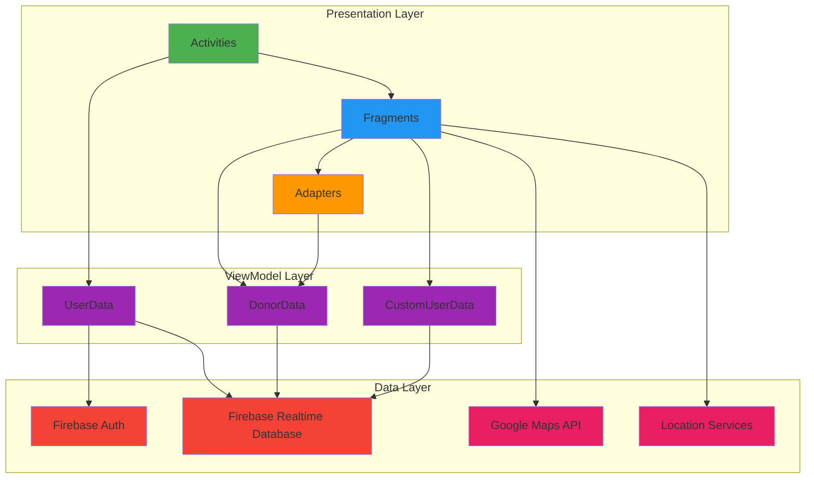
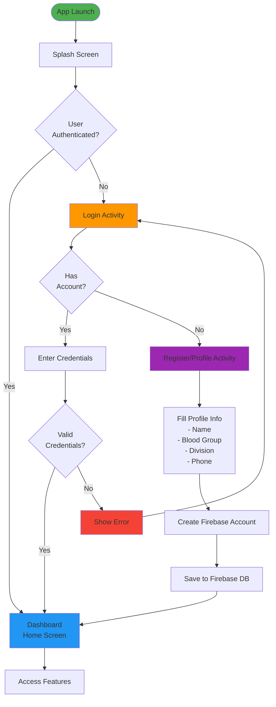
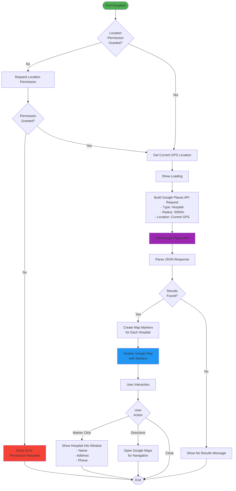
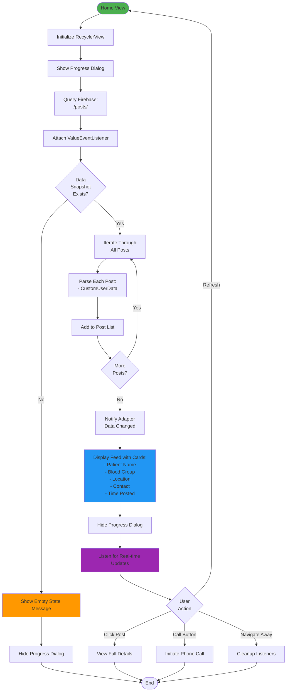
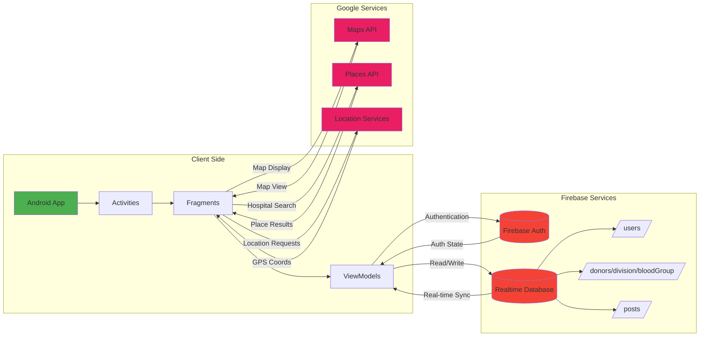

# 🩸 BloodBank Application

<div align="center">


**A comprehensive Android application connecting blood donors with those in need, featuring real-time blood request management, donor search, and nearby hospital finder.**

</div>

---

## 📑 Table of Contents

- [Overview](#-overview)
- [Features](#-features)
- [Architecture](#-architecture)
- [System Flowcharts](#-system-flowcharts)
- [Technology Stack](#-technology-stack)
- [Prerequisites](#-prerequisites)
- [Installation](#-installation)
- [Firebase Setup](#-firebase-setup)
- [Google Maps API Setup](#-google-maps-api-setup)
- [Usage](#-usage)
- [Project Structure](#-project-structure)
- [Contributing](#-contributing)
- [Code of Conduct](#-code-of-conduct)
- [License](#-license)
- [Contact](#-contact)

---

## 🌟 Overview

The **BloodBank Application** is a life-saving Android platform designed to bridge the gap between blood donors and recipients. Built with modern Android development practices and powered by Firebase, this application provides a seamless experience for users to:

- 🔍 Search for blood donors by blood group and location
- 📢 Post urgent blood requests
- 🏥 Find nearby hospitals using Google Maps
- 👤 Manage user profiles and donor information
- 📱 Real-time updates on blood requests

### Project Information

- **Project Name**: BloodBank
- **Package**: `com.android.iunoob.bloodbank`
- **Version**: 1.0
- **Created by**: imshakil
- **Email**: mhshakil_ice_iu@yahoo.com
- **Date**: October 2018

---

## ✨ Features

### 🔐 User Authentication
- Secure Firebase Authentication
- User registration and login
- Profile management

### 🩸 Blood Donor Management
- Register as a blood donor
- Update donor profile with blood group and location
- Search donors by blood group and division/region
- View donor contact information

### 📢 Blood Request System
- Post urgent blood requirement requests
- View all active blood requests in real-time
- Contact requesters directly via phone call
- Firebase Realtime Database for instant updates

### 🗺️ Location Services
- Google Maps integration
- Find nearby hospitals
- Location-based donor search
- Interactive map view with place markers

### 💬 Communication
- Direct phone call functionality to donors
- Contact information display
- Email integration

### 📊 Information Hub
- Blood donation information and guidelines
- About section with developer information
- Educational content about blood types

---

## 🏗️ Architecture

The application follows the **Model-View-ViewModel (MVVM)** architecture pattern with clear separation of concerns:



### Layer Description

#### 1. **Presentation Layer**
- **Activities**: Main screens and UI controllers
  - `SplashActivity`: App entry point with branding
  - `LoginActivity`: User authentication
  - `Dashboard`: Main navigation hub
  - `ProfileActivity`: User registration and profile editing
  - `PostActivity`: Create blood request posts

- **Fragments**: Modular UI components
  - `HomeView`: Display blood requests feed
  - `SearchDonorFragment`: Search and filter donors
  - `NearByHospitalActivity`: Map view of nearby hospitals
  - `BloodInfo`: Educational content
  - `AboutUs`: Developer information

- **Adapters**: RecyclerView adapters for list displays
  - `BloodRequestAdapter`: Blood request cards
  - `SearchDonorAdapter`: Donor list display

#### 2. **ViewModel Layer**
- `UserData`: User profile information model
- `DonorData`: Donor details and blood group info
- `CustomUserData`: Extended user data for blood requests
- `DataParser`: JSON data parsing utilities
- `DownloadUrl`: Network data fetching
- `GetNearbyPlacesData`: Google Places API integration

#### 3. **Data Layer**
- **Firebase Authentication**: User account management
- **Firebase Realtime Database**: Real-time data synchronization
  - `/users`: User profiles
  - `/donors`: Donor registry by division and blood group
  - `/posts`: Blood request posts
- **Google Maps API**: Location services and mapping
- **Location Services**: GPS and location tracking

---

## 📊 System Flowcharts

### 1. User Authentication Flow



### 2. Blood Donor Search Flow

```mermaid
flowchart TD
    Start([Search Donor]) --> Select[Select Blood Group<br/>and Division]
    Select --> Submit[Click Search Button]
    Submit --> ShowProgress[Show Progress Dialog]
    
    ShowProgress --> Query[Query Firebase DB:<br/>/donors/{division}/{bloodGroup}]
    Query --> CheckData{Data<br/>Exists?}
    
    CheckData -->|Yes| FetchDonors[Fetch Donor List]
    FetchDonors --> CreateList[Create RecyclerView List]
    CreateList --> DisplayDonors[Display Donors<br/>- Name<br/>- Phone<br/>- Location]
    
    CheckData -->|No| EmptyMsg[Show Empty Message]
    
    DisplayDonors --> UserAction{User<br/>Action}
    EmptyMsg --> End([End])
    
    UserAction -->|Click Donor| ShowDetails[Show Donor Details]
    UserAction -->|Call Button| MakeCall[Initiate Phone Call]
    UserAction -->|Back| End
    
    ShowDetails --> MakeCall
    MakeCall --> End
    
    style Start fill:#4CAF50
    style DisplayDonors fill:#2196F3
    style EmptyMsg fill:#FF9800
    style MakeCall fill:#9C27B0
```

### 3. Blood Request Posting Flow

```mermaid
flowchart TD
    Start([Create Post]) --> OpenForm[Open Post Activity]
    OpenForm --> FillDetails[Fill Blood Request Details<br/>- Required Blood Group<br/>- Patient Name<br/>- Hospital/Location<br/>- Contact Number<br/>- Urgency Level]
    
    FillDetails --> Validate{Valid<br/>Input?}
    
    Validate -->|No| ShowError[Show Validation Error]
    ShowError --> FillDetails
    
    Validate -->|Yes| CreatePost[Create Post Object]
    CreatePost --> GetUser[Get Current User ID]
    GetUser --> SavePost[Save to Firebase:<br/>/posts/{postId}]
    
    SavePost --> Success{Save<br/>Successful?}
    
    Success -->|Yes| Broadcast[Real-time Broadcast<br/>to All Users]
    Success -->|No| ErrorMsg[Show Error Message]
    
    Broadcast --> UpdateUI[Update Home Feed]
    UpdateUI --> ShowSuccess[Show Success Message]
    ShowSuccess --> RedirectHome[Redirect to Dashboard]
    
    ErrorMsg --> End([End])
    RedirectHome --> End
    
    style Start fill:#4CAF50
    style SavePost fill:#2196F3
    style Broadcast fill:#9C27B0
    style ShowSuccess fill:#4CAF50
    style ErrorMsg fill:#F44336
```

### 4. Nearby Hospital Finder Flow



### 5. Home Feed (Blood Requests) Flow



### 6. Complete Application Data Flow



---

## 🛠️ Technology Stack

### Core Technologies

| Category | Technology | Version | Purpose |
|----------|-----------|---------|---------|
| **Language** | Java | 8 | Primary development language |
| **IDE** | Android Studio | Latest | Development environment |
| **Build System** | Gradle | 3.2.1 | Build automation |
| **Min SDK** | Android API 17 | 4.2 (Jelly Bean) | Minimum Android version |
| **Target SDK** | Android API 28 | 9.0 (Pie) | Target Android version |

### Android Components

- **AppCompat** v28.0.0 - Backward-compatible Android features
- **RecyclerView** v28.0.0 - Efficient list displays
- **ConstraintLayout** v1.1.3 - Flexible UI layouts
- **Design Support Library** v28.0.0 - Material Design components
- **Architecture Components** v1.1.1 - Lifecycle management
- **MultiDex** v1.0.3 - Support for large applications

### Backend & Database

- **Firebase Authentication** v16.0.5 - User authentication
- **Firebase Realtime Database** v16.0.3 - Real-time data synchronization
- **Firebase Core** v16.0.4 - Firebase SDK core

### Location & Maps

- **Google Maps SDK** v16.0.0 - Map display and interaction
- **Google Places API** v16.0.0 - Nearby places search
- **Google Location Services** v16.0.0 - GPS and location tracking

### Testing

- **JUnit** v4.12 - Unit testing framework
- **Espresso** v3.0.2 - UI testing framework
- **AndroidX Test** v1.0.2 - Android testing support

---

## 📋 Prerequisites

Before you begin, ensure you have the following installed:

- ✅ **Android Studio** (Arctic Fox or later recommended)
- ✅ **JDK 8** or higher
- ✅ **Android SDK** with API 28
- ✅ **Gradle** 3.2.1 or higher
- ✅ **Firebase Account** (free tier is sufficient)
- ✅ **Google Cloud Account** (for Maps API)
- ✅ **Git** (for version control)

### System Requirements

- **OS**: Windows 7/8/10/11, macOS 10.14+, or Linux
- **RAM**: 8GB minimum (16GB recommended)
- **Disk Space**: 4GB minimum
- **Internet Connection**: Required for Firebase and Maps API

---

## 🚀 Installation

### Step 1: Clone the Repository

```bash
# Clone using HTTPS
git clone https://github.com/yourusername/BloodBank-Application.git

# OR clone using SSH
git clone git@github.com:yourusername/BloodBank-Application.git

# Navigate to project directory
cd BloodBank-Application
```

### Step 2: Open Project in Android Studio

1. Launch **Android Studio**
2. Click **"Open an Existing Project"**
3. Navigate to the cloned `BloodBank-Application` folder
4. Click **"OK"** and wait for Gradle sync to complete

### Step 3: Configure Firebase (See [Firebase Setup](#-firebase-setup))

### Step 4: Configure Google Maps API (See [Google Maps API Setup](#-google-maps-api-setup))

### Step 5: Build the Project

```bash
# Clean project
./gradlew clean

# Build debug APK
./gradlew assembleDebug

# Build release APK
./gradlew assembleRelease
```

### Step 6: Run the Application

1. Connect an Android device via USB (with USB Debugging enabled)
   - OR start an Android Emulator
2. Click the **"Run"** button (green play icon) in Android Studio
3. Select your target device
4. Wait for the app to install and launch

---

## 🔥 Firebase Setup

### Step 1: Create Firebase Project

1. Go to [Firebase Console](https://console.firebase.google.com/)
2. Click **"Add Project"** or **"Create a project"**
3. Enter project name: `BloodBank` (or your preferred name)
4. Accept terms and click **"Continue"**
5. Disable Google Analytics (optional) and click **"Create Project"**

### Step 2: Register Android App

1. In Firebase Console, click **Android icon** to add Android app
2. Enter package name: `com.android.iunoob.bloodbank`
3. Enter app nickname: `BloodBank App` (optional)
4. Leave SHA-1 blank for now (required for additional features later)
5. Click **"Register App"**

### Step 3: Download Configuration File

1. Download `google-services.json` file
2. Place it in the `app/` directory of your project
   ```
   BloodBank-Application/
   └── app/
       └── google-services.json  ← Place here
   ```

### Step 4: Enable Authentication

1. In Firebase Console, navigate to **Authentication** → **Sign-in method**
2. Click on **Email/Password**
3. Enable **Email/Password** authentication
4. Click **"Save"**

### Step 5: Setup Realtime Database

1. In Firebase Console, navigate to **Realtime Database**
2. Click **"Create Database"**
3. Select location (choose closest to your users)
4. Start in **Test Mode** for development
5. Click **"Enable"**

### Step 6: Configure Database Rules (Development)

```json
{
  "rules": {
    ".read": "auth != null",
    ".write": "auth != null",
    "users": {
      "$uid": {
        ".read": "auth != null",
        ".write": "auth.uid === $uid"
      }
    },
    "donors": {
      ".read": "auth != null",
      ".write": "auth != null"
    },
    "posts": {
      ".read": "auth != null",
      ".write": "auth != null"
    }
  }
}
```

> ⚠️ **Security Warning**: These rules are for development only. Implement proper security rules for production!

### Database Structure

```
bloodbank-app (root)
├── users/
│   └── {userId}/
│       ├── name: "John Doe"
│       ├── email: "john@example.com"
│       ├── phone: "+8801234567890"
│       ├── bloodGroup: "A+"
│       └── division: "Dhaka"
│
├── donors/
│   └── {division}/
│       └── {bloodGroup}/
│           └── {donorId}/
│               ├── name: "Jane Smith"
│               ├── phone: "+8809876543210"
│               ├── bloodGroup: "O+"
│               └── division: "Chittagong"
│
└── posts/
    └── {postId}/
        ├── patientName: "Alice Johnson"
        ├── bloodGroup: "B+"
        ├── location: "United Hospital, Dhaka"
        ├── contactNumber: "+8801122334455"
        ├── urgency: "High"
        ├── postedBy: "{userId}"
        └── timestamp: 1634567890000
```

---

## 🗺️ Google Maps API Setup

### Step 1: Create Google Cloud Project

1. Go to [Google Cloud Console](https://console.cloud.google.com/)
2. Click **"Select a project"** → **"New Project"**
3. Enter project name: `BloodBank Maps`
4. Click **"Create"**

### Step 2: Enable Required APIs

1. Navigate to **APIs & Services** → **Library**
2. Search and enable the following APIs:
   - ✅ **Maps SDK for Android**
   - ✅ **Places API**
   - ✅ **Geolocation API**

### Step 3: Create API Credentials

1. Navigate to **APIs & Services** → **Credentials**
2. Click **"Create Credentials"** → **"API Key"**
3. Copy the generated API key
4. Click **"Restrict Key"** (recommended)

### Step 4: Restrict API Key (Recommended)

1. Under **Application restrictions**, select **"Android apps"**
2. Click **"Add an item"**
3. Enter package name: `com.android.iunoob.bloodbank`
4. Add SHA-1 certificate fingerprint:

   **For Debug:**
   ```bash
   keytool -list -v -keystore ~/.android/debug.keystore -alias androiddebugkey -storepass android -keypass android
   ```

   **For Release:**
   ```bash
   keytool -list -v -keystore /path/to/your/keystore.jks -alias your-key-alias
   ```

5. Under **API restrictions**, select **"Restrict key"**
6. Select:
   - Maps SDK for Android
   - Places API
7. Click **"Save"**

### Step 5: Add API Key to Project

1. Open `app/src/main/res/values/strings.xml`
2. Add your API key:

```xml
<resources>
    <string name="app_name">Blood Bank</string>
    <string name="google_maps_key">YOUR_GOOGLE_MAPS_API_KEY_HERE</string>
    <!-- Other strings -->
</resources>
```

> ⚠️ **Security Note**: Never commit API keys to public repositories. Use environment variables or gradle.properties for sensitive data.

---

## 📱 Usage

### First Time Setup

1. **Launch the App**
   - App opens with splash screen

2. **Create an Account**
   - Click **"Register"** on login screen
   - Fill in your details:
     - Full Name
     - Email Address
     - Password
     - Phone Number
     - Blood Group (A+, A-, B+, B-, AB+, AB-, O+, O-)
     - Division/Region
   - Click **"Register"**

3. **Login**
   - Enter registered email and password
   - Click **"Login"**

### Main Features Usage

#### 🔍 Search for Blood Donors

1. From Dashboard, tap **"Find Blood Donor"** in navigation menu
2. Select **Blood Group** from dropdown
3. Select **Division/Region** from dropdown
4. Tap **"Search"** button
5. View list of matching donors
6. Tap on donor to view details
7. Click **Call** button to contact donor directly

#### 📢 Post Blood Request

1. Tap the **floating action button (+)** on Dashboard
2. Fill in blood request details:
   - Patient Name
   - Required Blood Group
   - Hospital/Location
   - Contact Number
   - Urgency Level
   - Additional Notes
3. Tap **"Post Request"**
4. Request appears in home feed for all users

#### 🏥 Find Nearby Hospitals

1. From Dashboard, tap **"Nearby Hospitals"** in navigation menu
2. Grant location permission when prompted
3. View map with hospital markers
4. Tap marker to see hospital details
5. Get directions via Google Maps

#### 👤 Update Profile

1. From Dashboard, tap **"User Profile"** in navigation menu
2. Update your information:
   - Name
   - Blood Group
   - Division
   - Phone Number
3. Tap **"Save"** to update

#### 📚 View Blood Donation Info

1. From Dashboard, tap **⋮** (three dots) menu
2. Select **"Donate Info"**
3. Read blood donation guidelines and information

---

## 📁 Project Structure

```
BloodBank-Application/
│
├── app/
│   ├── src/
│   │   ├── main/
│   │   │   ├── java/com/android/iunoob/bloodbank/
│   │   │   │   ├── activities/
│   │   │   │   │   ├── Dashboard.java
│   │   │   │   │   ├── LoginActivity.java
│   │   │   │   │   ├── PostActivity.java
│   │   │   │   │   ├── ProfileActivity.java
│   │   │   │   │   └── SplashActivity.java
│   │   │   │   │
│   │   │   │   ├── fragments/
│   │   │   │   │   ├── AboutUs.java
│   │   │   │   │   ├── BloodInfo.java
│   │   │   │   │   ├── HomeView.java
│   │   │   │   │   ├── NearByHospitalActivity.java
│   │   │   │   │   └── SearchDonorFragment.java
│   │   │   │   │
│   │   │   │   ├── adapters/
│   │   │   │   │   ├── BloodRequestAdapter.java
│   │   │   │   │   └── SearchDonorAdapter.java
│   │   │   │   │
│   │   │   │   └── viewmodels/
│   │   │   │       ├── CustomUserData.java
│   │   │   │       ├── DataParser.java
│   │   │   │       ├── DonorData.java
│   │   │   │       ├── DownloadUrl.java
│   │   │   │       ├── GetNearbyPlacesData.java
│   │   │   │       └── UserData.java
│   │   │   │
│   │   │   ├── res/
│   │   │   │   ├── layout/          # XML layout files
│   │   │   │   ├── drawable/        # Images and icons
│   │   │   │   ├── values/          # Strings, colors, styles
│   │   │   │   └── mipmap/          # App icons
│   │   │   │
│   │   │   ├── AndroidManifest.xml  # App configuration
│   │   │   └── google-services.json # Firebase config
│   │   │
│   │   ├── test/                    # Unit tests
│   │   └── androidTest/             # Instrumented tests
│   │
│   ├── build.gradle                 # App-level Gradle config
│   └── proguard-rules.pro          # ProGuard configuration
│
├── gradle/                          # Gradle wrapper
├── build.gradle                     # Project-level Gradle config
├── settings.gradle                  # Gradle settings
├── gradlew                         # Gradle wrapper script (Unix)
├── gradlew.bat                     # Gradle wrapper script (Windows)
│
├── CODE_OF_CONDUCT.md              # Community guidelines
├── CONTRIBUTING.md                 # Contribution guidelines
└── README.md                       # This file
```

### Key Components Description

#### Activities
- **SplashActivity**: Entry point with app logo and branding
- **LoginActivity**: User authentication interface
- **Dashboard**: Main navigation hub with drawer menu
- **ProfileActivity**: User registration and profile editing
- **PostActivity**: Create and submit blood requests

#### Fragments
- **HomeView**: Displays feed of blood requests using RecyclerView
- **SearchDonorFragment**: Search interface with blood group and division filters
- **NearByHospitalActivity**: Google Maps integration for hospital locations
- **BloodInfo**: Educational content about blood donation
- **AboutUs**: Developer and app information

#### Adapters
- **BloodRequestAdapter**: Binds blood request data to RecyclerView
- **SearchDonorAdapter**: Binds donor data to search results list

#### ViewModels/Data Models
- **UserData**: User profile structure
- **DonorData**: Donor information model
- **CustomUserData**: Extended user data for blood posts
- **DataParser**: JSON parsing for Google Places API
- **DownloadUrl**: HTTP request handler
- **GetNearbyPlacesData**: Processes nearby places data

---

## 🤝 Contributing

We welcome contributions from developers around the world! This project is especially open to **Bangladeshi students** who want to make it worthy and free for Android users on Google Play.

### How to Contribute

1. **Fork the Repository**
   ```bash
   # Click the "Fork" button on GitHub
   ```

2. **Clone Your Fork**
   ```bash
   git clone https://github.com/YOUR_USERNAME/BloodBank-Application.git
   cd BloodBank-Application
   ```

3. **Create a Feature Branch**
   ```bash
   git checkout -b feature/YourFeatureName
   ```

4. **Make Your Changes**
   - Write clean, documented code
   - Follow existing code style
   - Add comments where necessary

5. **Test Your Changes**
   - Run unit tests: `./gradlew test`
   - Run UI tests: `./gradlew connectedAndroidTest`
   - Manual testing on different devices

6. **Commit Your Changes**
   ```bash
   git add .
   git commit -m "Add: Brief description of your changes"
   ```

7. **Push to Your Fork**
   ```bash
   git push origin feature/YourFeatureName
   ```

8. **Create Pull Request**
   - Go to original repository on GitHub
   - Click "New Pull Request"
   - Select your branch
   - Describe your changes in detail
   - Submit the pull request

### Contribution Guidelines

- ✅ Follow Android coding best practices
- ✅ Write meaningful commit messages
- ✅ Add comments for complex logic
- ✅ Update documentation for new features
- ✅ Test on multiple Android versions
- ✅ Ensure backward compatibility (API 17+)
- ✅ Follow Material Design guidelines for UI

### Areas for Contribution

We're particularly looking for help with:

- 🌐 **Localization**: Add support for multiple languages
- 🎨 **UI/UX Improvements**: Enhance user interface and experience
- 🔒 **Security**: Implement security best practices
- 🧪 **Testing**: Increase test coverage
- 📱 **Features**: Add new features like:
  - Blood donation appointment scheduling
  - Push notifications for urgent requests
  - Blood donation history tracking
  - Social media sharing
  - Emergency SOS button
  - Blood bank inventory management
- 🐛 **Bug Fixes**: Fix reported issues
- 📚 **Documentation**: Improve README and code comments

### Reporting Issues

Found a bug or have a feature request?

1. Check if issue already exists in [Issues](https://github.com/yourusername/BloodBank-Application/issues)
2. If not, create a new issue with:
   - Clear, descriptive title
   - Detailed description
   - Steps to reproduce (for bugs)
   - Expected vs actual behavior
   - Screenshots if applicable
   - Device and Android version info

---

## 📜 Code of Conduct

This project adheres to the [Citizen Code of Conduct](CODE_OF_CONDUCT.md). By participating, you are expected to uphold this code.

### Our Pledge

We are committed to providing a friendly, safe, and welcoming environment for all contributors, regardless of:
- Gender, sexual orientation
- Ability or disability
- Ethnicity or nationality
- Socioeconomic status
- Religion or beliefs

### Expected Behavior

- ✅ Be respectful and inclusive
- ✅ Exercise empathy and kindness
- ✅ Accept constructive criticism gracefully
- ✅ Focus on what's best for the community
- ✅ Show professionalism in all interactions

### Unacceptable Behavior

- ❌ Harassment, trolling, or derogatory comments
- ❌ Personal or political attacks
- ❌ Publishing others' private information
- ❌ Any conduct that could be considered inappropriate

For full details, please read our [Code of Conduct](CODE_OF_CONDUCT.md).

---

## 📄 License

This project is licensed under the **MIT License** - see the [LICENSE](LICENSE) file for details.

```
MIT License

Copyright (c) 2018 imshakil

Permission is hereby granted, free of charge, to any person obtaining a copy
of this software and associated documentation files (the "Software"), to deal
in the Software without restriction, including without limitation the rights
to use, copy, modify, merge, publish, distribute, sublicense, and/or sell
copies of the Software, and to permit persons to whom the Software is
furnished to do so, subject to the following conditions:

The above copyright notice and this permission notice shall be included in all
copies or substantial portions of the Software.

THE SOFTWARE IS PROVIDED "AS IS", WITHOUT WARRANTY OF ANY KIND, EXPRESS OR
IMPLIED, INCLUDING BUT NOT LIMITED TO THE WARRANTIES OF MERCHANTABILITY,
FITNESS FOR A PARTICULAR PURPOSE AND NONINFRINGEMENT. IN NO EVENT SHALL THE
AUTHORS OR COPYRIGHT HOLDERS BE LIABLE FOR ANY CLAIM, DAMAGES OR OTHER
LIABILITY, WHETHER IN AN ACTION OF CONTRACT, TORT OR OTHERWISE, ARISING FROM,
OUT OF OR IN CONNECTION WITH THE SOFTWARE OR THE USE OR OTHER DEALINGS IN THE
SOFTWARE.
```

---

## 📞 Contact

### Project Maintainer

- **Name**: imshakil
- **Email**: mhshakil_ice_iu@yahoo.com
- **GitHub**: [@yourusername](https://github.com/yourusername)

### Get in Touch

- 🐛 **Report Bugs**: [Issue Tracker](https://github.com/yourusername/BloodBank-Application/issues)
- 💡 **Feature Requests**: [Discussions](https://github.com/yourusername/BloodBank-Application/discussions)
- 📧 **Email**: mhshakil_ice_iu@yahoo.com
- 💬 **Community**: Join our community discussions

---

## 🙏 Acknowledgments

- **Firebase** - For providing excellent backend infrastructure
- **Google Maps Platform** - For location services and mapping
- **Android Community** - For continuous support and resources
- **All Contributors** - Thank you for making this project better!

---

## 🌟 Star This Repository

If you find this project useful, please consider giving it a ⭐ on GitHub! It helps others discover the project and motivates us to continue improving it.

---

## 📈 Future Roadmap

- [ ] Implement push notifications for urgent blood requests
- [ ] Add blood donation appointment scheduler
- [ ] Integrate blood donation history and badges
- [ ] Add multilingual support (Bengali, Hindi, etc.)
- [ ] Implement chatbot for quick assistance
- [ ] Add admin panel for managing blood inventory
- [ ] Integrate with hospitals for real-time blood availability
- [ ] Add emergency SOS feature
- [ ] Implement social media sharing for requests
- [ ] Create blood donation awareness campaigns section
- [ ] Add statistics dashboard for users
- [ ] Implement dark mode UI theme

---

<div align="center">

**Made with ❤️ to save lives**

⭐ **Star us on GitHub — it helps!** ⭐

[Report Bug](https://github.com/yourusername/BloodBank-Application/issues) · [Request Feature](https://github.com/yourusername/BloodBank-Application/issues)

</div>
